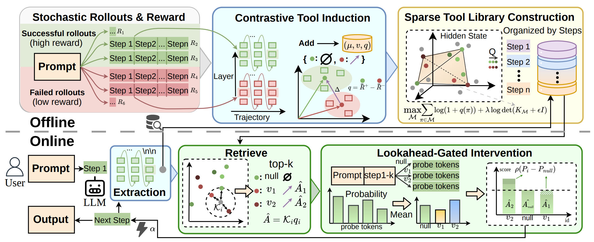

# STIR: Self-Distilled Latent Tools for Dynamic Control of LLM Reasoning

This repository contains the implementation for the paper **"STIR: Self-Distilled Latent Tools for Dynamic Control of LLM Reasoning"**.

## 📖 Abstract



The internalization of chain-of-thought (CoT) processes into hidden states has emerged as a highly efficient paradigm for scaling test-time compute. However, existing activation steering methods rely on static control vectors that fail to adapt to the non-stationary evolution of complex reasoning tasks.

**STIR (Self-Distilled Tools for Internal Reasoning)** reformulates reasoning enhancement as a **dynamic latent trajectory control problem**. Rather than applying a static, uniform bias, STIR empowers the model to adaptively self-correct by retrieving precise, context-specific steering impulses from a sparse library of its own distilled reasoning successes.

**Key Benefits:**

- **High Accuracy**: Improves average accuracy by **1.9% to 7.5%** across arithmetic and logical benchmarks.
- **High Efficiency**: Reduces token consumption by up to **36%** compared to standard CoT decoding.
- **Dynamic Control**: Introduces a *Retrieve-Preview-Commit* cycle to intervene only when necessary, avoiding over-steering.

## 🔥 Main Results

Extensive experiments on six benchmarks (including AIME 24/25, AMC 23, MATH-500, ARC-Challenge and OpenBookQA) demonstrate that STIR establishes a new accuracy-efficiency Pareto frontier. The table below highlights performance on **Qwen2.5 3B-Instruct**:

| Method               | Avg. Accuracy | Avg. Tokens | Mechanism                             |
| -------------------- | ------------- | ----------- | ------------------------------------- |
| **Vanilla CoT**      | 45.9%         | 1,359       | Standard Autoregressive Generation    |
| **Self-Consistency** | 45.2%         | 2,084       | Ensemble Sampling (High Cost)         |
| **Self-Discover**    | 46.4%         | 1,075       | Structure-Driven Prompting            |
| **DEER**             | 44.4%         | 1,278       | Dynamic Early Exit                    |
| **SEAL (Static)**    | 45.2%         | 1,303       | Static Activation Steering            |
| **STIR (Ours)**      | **53.4%**     | **875**     | **Dynamic Latent Trajectory Control** |

*STIR (*$k_{scale}=0.75$*) achieves a **+7.5%** accuracy gain while reducing token usage by **~36%** compared to Vanilla CoT on Qwen2.5 3B-Instruct. See Table 1 in the paper for full results across all models.*

## 🌲 Repository Structure Details

The codebase is organized as follows:

```
.
├── configs/                  # Experiment configurations (YAML format)
├── stir/                     # Core source code
│   ├── offline/              # Offline Pipeline: Mining & Library Construction
│   │   ├── stage1.py         # Stage I: Differential Intrinsic Action Induction (Contrastive Rollouts)
│   │   ├── stage2.py         # Stage II: Sparse Control Basis Construction (DPP Selection)
│   │   ├── stage3.py         # Stage III: Episodic Memory Indexing (L2 Normalized Keys)
│   │   └── hf_states.py      # Utils: Efficient hidden state extraction from HF models
│   ├── online/               # Online Inference: Dynamic Controller
│   │   ├── stir.py           # STIR Logic (Retrieve-Preview-Commit Cycle)
│   │   ├── memory.py         # Vector retrieval module (Top-k similarity search)
│   │   └── greedy.py         # Baseline implementation (Standard CoT Decoding)
│   ├── data/                 # Data Handling
│   │   ├── loaders.py        # Dataset loaders (MATH500, GSM8K, AIME, ARC, etc.)
│   │   ├── prompts.py        # Prompt template management
│   │   └── tasks.py          # Unified task definitions
│   ├── eval/                 # Evaluation Tools
│   │   ├── metrics.py        # Accuracy calculation logic
│   │   └── extractors.py     # Answer extraction regex (optimized per dataset)
│   ├── entrypoints/          # CLI Subcommands (mine, select, memory, eval)
│   └── utils/                # Utilities (Logging, IO, Device Management)
├── scripts/
│   └── run_single_dataset.sh # End-to-end execution script
└── run.py                    # Unified CLI entrypoint
```

## 🛠️ Installation

### Prerequisites

- Python 3.10+
- PyTorch (CUDA support)
- vLLM & Easysteer (Required for efficient inference and steering hooks)

### Setup steps

1. Create a conda environment:

   ```
   conda create -n stir python=3.10 -y
   conda activate stir
   ```

2. Install dependencies:

   ```
   pip install -r requirements.txt
   ```

## 📂 Data & Models

1. **Models**:
   - Supports HuggingFace models (e.g., `DeepSeek-R1-Distill-Qwen-1.5B`).
   - Configure the model path or HF ID in the `model.name_or_path` field within `configs/*.yaml`.
2. **Datasets**:
   - Place dataset files in the `datasets/` directory.
   - Supported datasets: `math500`, `gsm8k`, `aime2024`, `aime2025`, `arc-c`, `amc23`.
   - Refer to `stir/data/loaders.py` for specific file format requirements.

## ⚡ Quick Start

Run the full STIR pipeline (Mining $\rightarrow$ Selection $\rightarrow$ Memory $\rightarrow$ Evaluation) on a single dataset using the following command:

```
# Run STIR on MATH-500 (using default config)
# Usage: bash scripts/run_single_dataset.sh <config_path> <gpu_id>
bash scripts/run_single_dataset.sh configs/math.yaml 0
```

*Note: Ensure the model path in `configs/math.yaml` points to your correct local path.*

## 🔬 Detailed Usage Pipeline

You can run each stage individually using `run.py`. This is useful for debugging intermediate results or tuning hyperparameters.

### Stage 1: Differential Intrinsic Action Induction (Mine)

Harvest latent reasoning successes by comparing high-reward and low-reward stochastic rollouts.

```
python run.py --config configs/math.yaml mine
```

- **Output**: `outputs/<run_name>/<run_id>/mine/candidates.jsonl` (Raw candidate vectors)

### Stage 2: Sparse Control Basis Construction (Select)

Filter raw candidates into a geometrically diverse tool library using Determinantal Point Processes (DPP).

```
# Use 'latest' to automatically pick up the run_id from the previous step
python run.py --config configs/math.yaml --run-id latest select
```

- **Output**: `outputs/<run_name>/<run_id>/library/library.jsonl` (Selected tool library)

### Stage 3: Episodic Memory Indexing (Memory)

Build the low-latency retrieval index (L2-normalized keys) for online inference.

```
python run.py --config configs/math.yaml --run-id latest memory
```

- **Output**: `outputs/<run_name>/<run_id>/memory/keys.npy`

### Stage 4: Value-Modulated Trajectory Intervention (Eval)

Launch the STIR controller for inference evaluation.

```
python run.py --config configs/math.yaml --run-id latest eval
```

- **Output**:
  - `outputs/<run_name>/<run_id>/tables/main_results_single.csv` (Main metrics)
  - `outputs/<run_name>/<run_id>/cases/` (Detailed case analysis reports)

## ⚙️ Configuration Guide

The behavior of STIR is fully controlled via YAML configuration files (e.g., `configs/math.yaml`). Below are the key parameters:

### Mining (Offline)

- **`offline_mine`**:
  - `K`: Number of stochastic rollouts per prompt (default: 8).
  - `candidate_layers`: Target layers for vector extraction (e.g., `[0.6]` targets 60% depth).
  - `method`: `contrastive` (Standard STIR) or `random` (Ablation).

### Selection (Offline)

- **`offline_select`**:
  - `B`: Memory budget (number of tools to keep, e.g., 256).
  - `method`: `dpp` is recommended to ensure diversity.

### Inference & Control (Online)

- **`online`**:
  - `k_retrieve`: Number of candidate tools to retrieve per step.
  - `probe_tokens`: Number of tokens generated during the preview phase to validate tool utility.
  - `k_scale`: Injection strength coefficient for the steering vector.
  - `tau_null`: Anchor-based gating threshold.

### Model & Decoding

- **`model`**:
  - `name_or_path`: Path to the local HuggingFace model or Repo ID.
  - `gpu_memory_utilization`: VRAM fraction allocated for vLLM.
- **`decode`**:
  - `temperature`: Sampling temperature.
  - `max_new_tokens`: Maximum generation length.